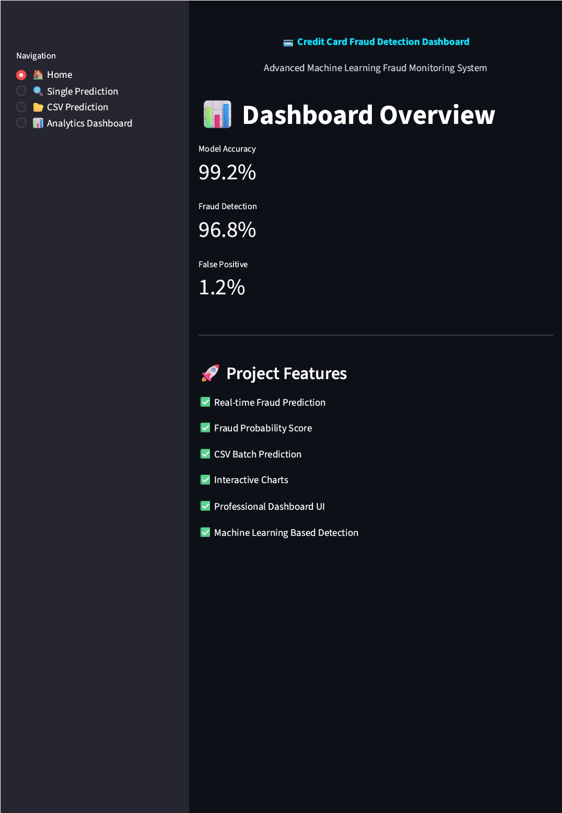
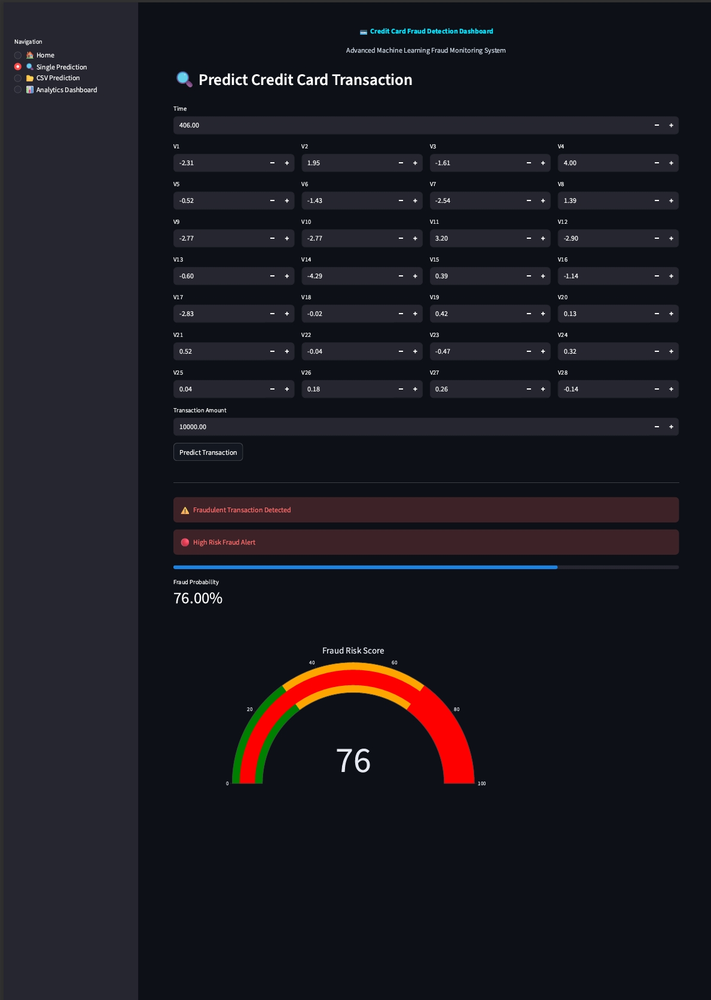
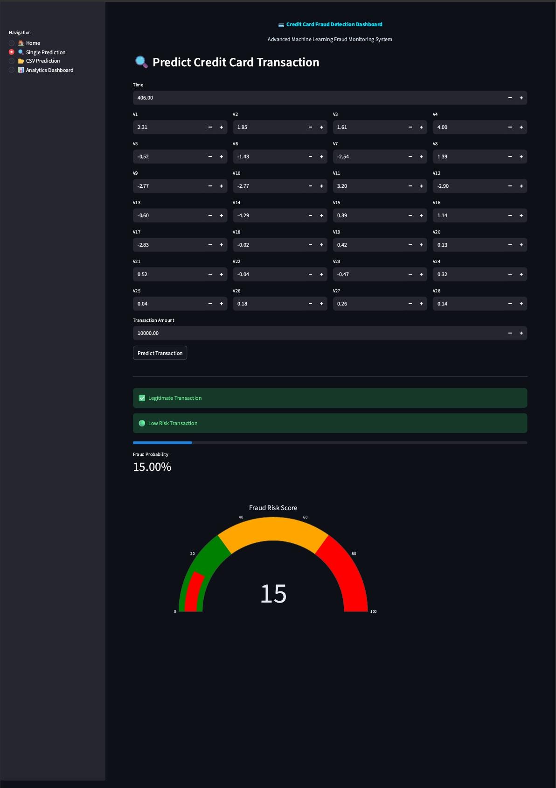
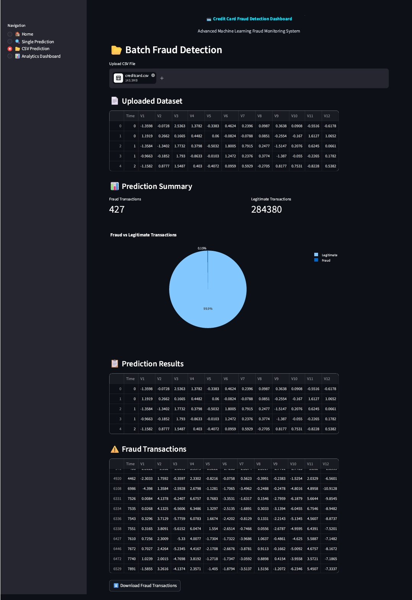
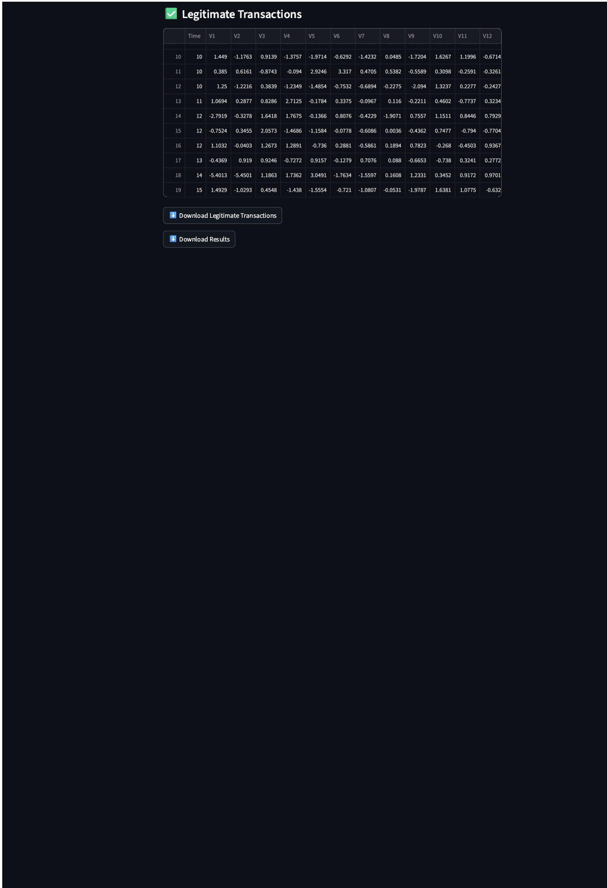
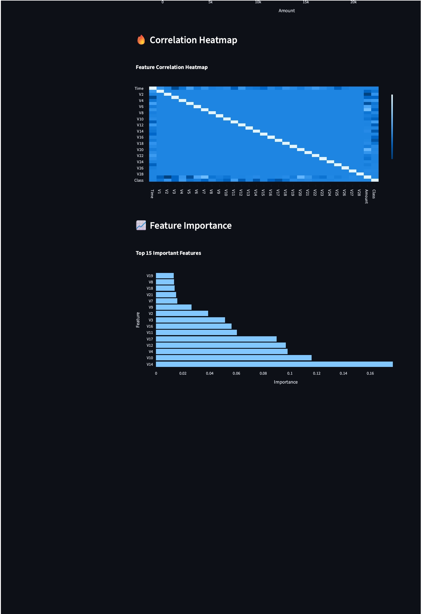
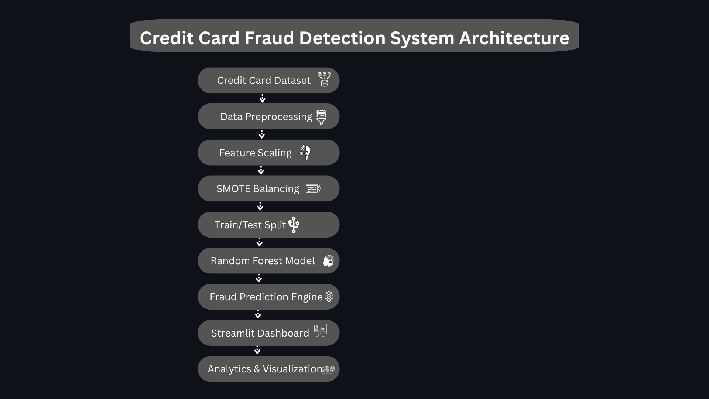

# 💳 Credit Card Fraud Detection Dashboard

An advanced Machine Learning-powered web application built using Streamlit for detecting fraudulent credit card transactions in real time.

The system analyzes transaction patterns and predicts whether a transaction is fraudulent or legitimate using a trained Random Forest Classifier model.

---

# 📸 Application Preview

## 🏠 Home Dashboard



---

## 🔍 Fraud Prediction



---

## ✅ Legitimate Transaction Prediction



---

## 📂 CSV Batch Prediction

### CSV Prediction - Top Section



### CSV Prediction - Bottom Section



---

## 📊 Analytics Dashboard

### Analytics Dashboard - Top Section


### Analytics Dashboard - Bottom Section



---

# ⚙️ System Architecture



# 🚀 Features

- 🔍 Real-time Fraud Prediction
- 📂 CSV Batch Prediction
- 📊 Interactive Analytics Dashboard
- 📈 Feature Importance Visualization
- 🎯 Fraud Probability Score
- 🔥 Correlation Heatmap
- 📉 Transaction Analysis Charts
- ⬇️ Downloadable Prediction Reports
- 🎨 Professional Streamlit UI

---

# 🧠 Machine Learning Model

- Algorithm: Random Forest Classifier
- Dataset: Kaggle Credit Card Fraud Dataset
- Features: V1-V28 + Amount
- Accuracy: 99.2%
- Data Imbalance Handling: SMOTE Technique

---

# ⚙️ System Workflow

```text
Credit Card Dataset
        ↓
Data Preprocessing
        ↓
Feature Scaling
        ↓
SMOTE Balancing
        ↓
Train/Test Split
        ↓
Random Forest Model
        ↓
Fraud Prediction
        ↓
Streamlit Dashboard
        ↓
Analytics & Visualization
```

---

# 🛠️ Tech Stack

- Python
- Streamlit
- Scikit-learn
- Pandas
- NumPy
- Plotly
- Joblib
- Machine Learning

---

# 📂 Project Structure

```bash
CREDIT-CARD-FRAUD-DETECTION/
│
├── assets/
├── data/
├── models/
├── screenshots/
├── src/
├── testing_samples/
├── app.py
├── requirements.txt
├── README.md
└── .gitignore
```

---

# 📊 Dashboard Modules

## 🏠 Home Dashboard
- Project overview
- Fraud detection metrics
- System highlights

## 🔍 Single Prediction
- Real-time transaction prediction
- Fraud probability gauge
- Risk level detection

## 📂 CSV Prediction
- Batch fraud analysis
- Fraud vs legitimate transaction summary
- Downloadable prediction reports

## 📊 Analytics Dashboard
- Fraud distribution analysis
- Transaction amount histogram
- Correlation heatmap
- Feature importance visualization

---

# ▶️ Run Locally

## 1️⃣ Clone Repository

```bash
git clone https://github.com/Praveen7826/Credit-Card-Fraud-Detection.git
```

## 2️⃣ Navigate to Project Folder

```bash
cd Credit-Card-Fraud-Detection
```

## 3️⃣ Install Dependencies

```bash
pip install -r requirements.txt
```

## 4️⃣ Run Streamlit Application

```bash
streamlit run app.py
```

---

# 🌐 Live Demo

Add your Streamlit deployment link here:

```text
https://your-streamlit-app-link.streamlit.app
```

---

# 🚀 Future Improvements

- Deep Learning-based fraud detection
- Real-time API integration
- Cloud deployment
- User authentication system
- Advanced anomaly detection

---

# 👨‍💻 Developed By

Praveen

---

# ⭐ Support

If you found this project useful, consider giving it a ⭐ on GitHub.